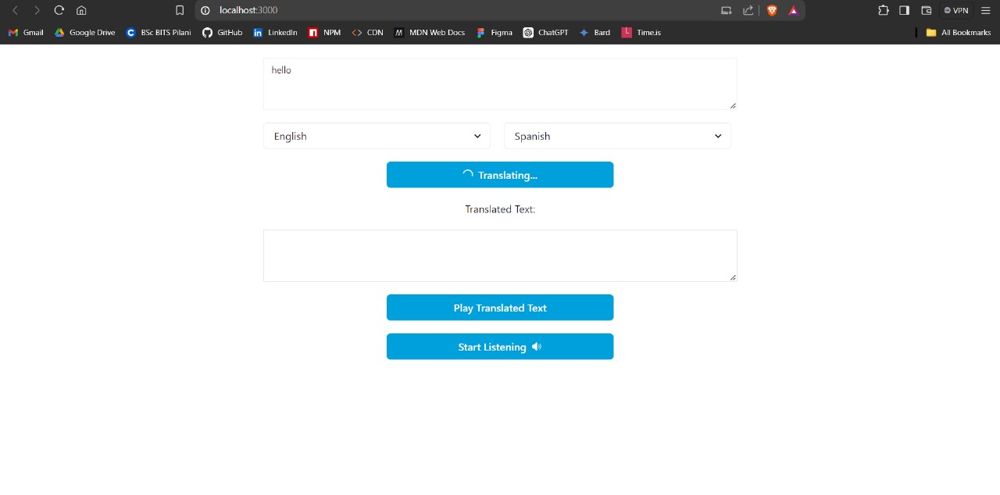
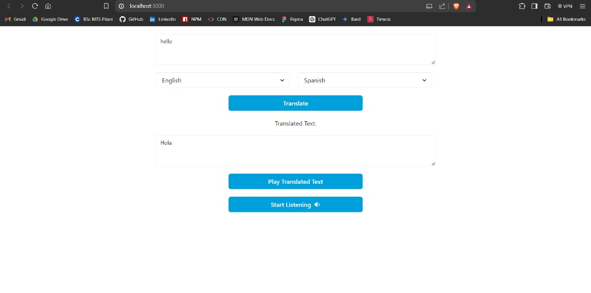

# Multilingual Text and Speech Translator

This project is a MERN stack-based web application that enables users to translate text between multiple languages with ease. The application features a simple and clean UI for entering text, selecting source and target languages, and displaying the translated text. Optional features include automatic language detection, speech-to-text input, and text-to-speech output. The backend leverages Google Translate API for accurate translations, while MongoDB stores translation data for analysis. Designed for scalability and efficiency, this application can handle multiple concurrent translation requests and is deployable on scalable platforms like AWS and Google Cloud. Monitoring and testing strategies ensure robust performance and reliability.

## Getting Started

```bash
git clone https://github.com/Hashal890/multilingual-text-and-speech-translator.git
cd multilingual-text-and-speech-translator
```
**Frontend:**
```bash
cd frontend
npm install
npm run start
```
**Backend:**
```bash
cd backend
npm install
npm run dev
```

## Deployment

- [Frontend](https://multilingual-text-and-speech-translator.vercel.app/)
- [Backend](https://multilingual-text-and-speech-translator.onrender.com)

## Technology Stack

List of the technologies used in the project.

- [MongoDB](https://www.mongodb.com/)
- [Express.js](https://expressjs.com/)
- [React.js](https://legacy.reactjs.org/docs/getting-started.html)
- [JavaScript](https://developer.mozilla.org/en-US/docs/Web/JavaScript)
- [React Speech Recognition](https://www.npmjs.com/package/react-speech-recognition)
- [Axios](https://axios-http.com/docs/intro)
- [Dotenv](https://www.npmjs.com/package/dotenv)
- [CSS](https://developer.mozilla.org/en-US/docs/Web/CSS)
- [Chakra UI](https://chakra-ui.com/getting-started)
- [React Icons](https://react-icons.github.io/)

## Screenshots

**Home Page Loading**


**Home Page Result**


## Connect with Me

- [LinkedIn](https://www.linkedin.com/in/harshalpardeshi/)
- [Email](mailto:pardeshiharshal90@gmail.com)
